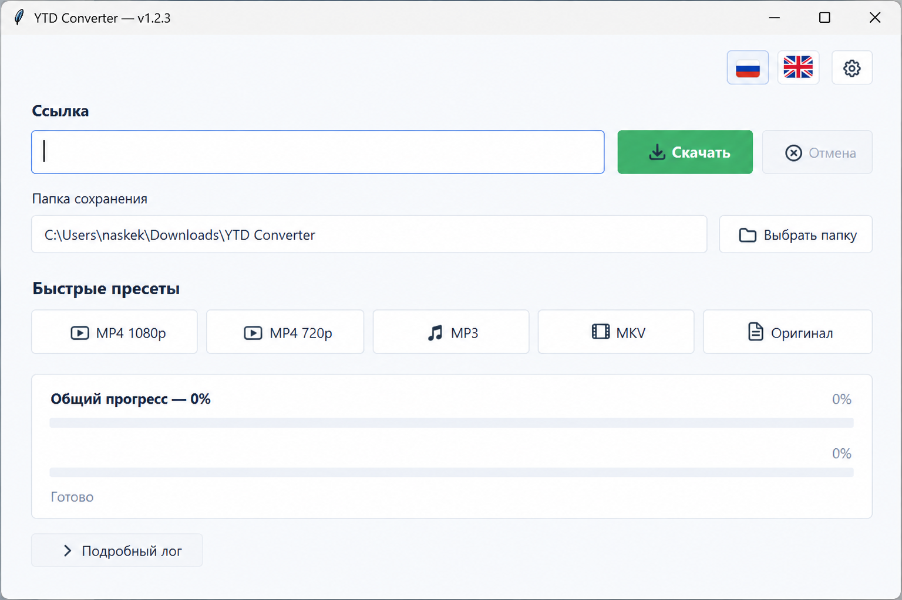

# YTD Converter

Простой GUI для Windows поверх `yt-dlp` и `FFmpeg` для скачивания и конвертации видео и аудио.

## Скачать последнюю версию

**Текущий релиз: v1.2.3**

- **Установщик для Windows — рекомендуется:** [YTDConverterSetup-1.2.3.exe](https://github.com/naskek/YTD-GUI/releases/download/v1.2.3/YTDConverterSetup-1.2.3.exe)
- **Портативная версия:** [YTDConverter-1.2.3.exe](https://github.com/naskek/YTD-GUI/releases/download/v1.2.3/YTDConverter-1.2.3.exe)
- [Страница последнего релиза](https://github.com/naskek/YTD-GUI/releases/latest)

> Приложение пока не подписано цифровым сертификатом, поэтому Windows SmartScreen может показать предупреждение при первом запуске.

## Возможности

- MP4 1080p и 720p
- MP3
- MKV
- загрузка в исходном формате
- отображение прогресса загрузки и постобработки
- автоматическое обновление `yt-dlp` и `FFmpeg`
- встроенное обновление приложения без запуска полного установщика
- поддержка `cookies.txt` для видео, требующих входа в YouTube
- русский и английский интерфейс

## YouTube cookies

Для обычных публичных видео cookies не нужны. Если YouTube требует вход, приложение предложит выбрать свежий `cookies.txt`.

Файл можно экспортировать из Chrome расширением **Get cookies.txt LOCALLY** в формате Netscape. Не передавайте `cookies.txt` другим людям — он содержит данные вашей сессии.

## Скриншот

  

